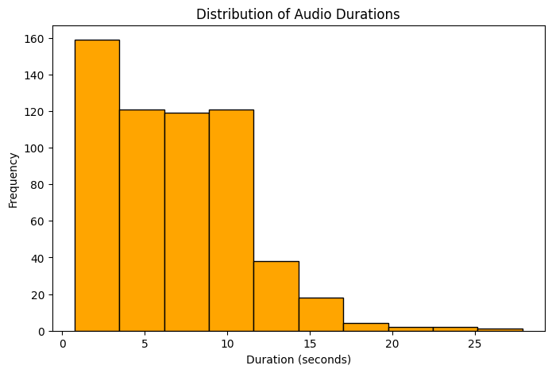
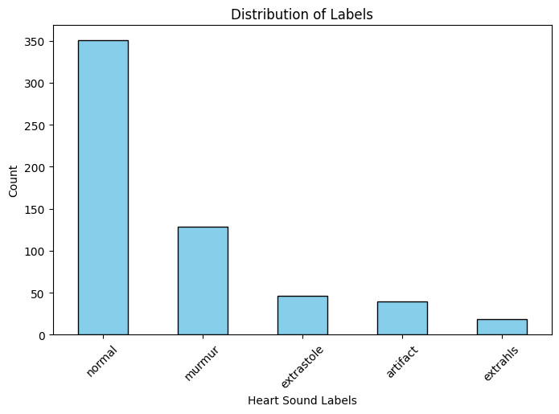
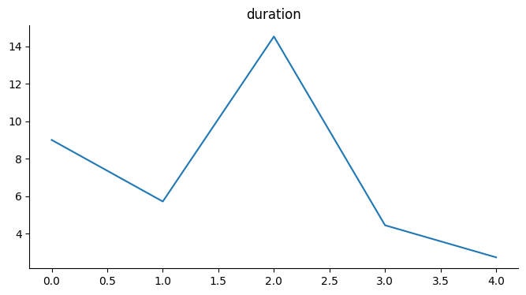
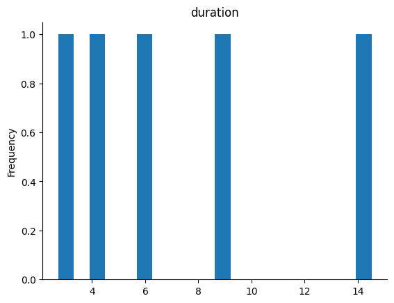

# Heart Sound Classification: A Deep Learning Approach Using CNN-RNN Architectures with Attention

## Project Overview

This project focuses on the automated classification of heart sounds into distinct categories (Normal, Murmur, Extra Heart Sound, Artifact, Extrasystole) using deep learning. It leverages a hybrid Convolutional Neural Network (CNN) and Recurrent Neural Network (RNN) framework, incorporating advanced techniques like wavelet denoising, MFCC feature extraction, and a soft attention mechanism to enhance classification accuracy and interpretability.

## 1. Introduction

Cardiovascular diseases remain a leading cause of mortality globally. Early and accurate diagnosis, often aided by analyzing heart sounds (phonocardiography), is crucial. However, manual interpretation of these sounds by medical professionals is time-consuming and requires extensive expertise. The advent of deep learning offers a powerful avenue to automate this diagnostic step, enabling more efficient and accessible diagnostic tools.

The core task is to build a robust model that can classify heart sound recordings into five specific categories:
* **Normal**: Healthy heart sounds.
* **Murmur**: Sounds indicative of turbulent blood flow.
* **Extra Heart Sound (Extrahls)**: Additional, often pathological, sounds.
* **Artifact**: External noise or interference.
* **Extrasystole**: Premature heartbeats.

[cite_start] The project utilizes the diverse Pascal Heart Sound Dataset [cite: 2, 3, 4][cite_start] , which combines recordings from public sources (iStethoscope Pro - Dataset A) and hospital environments (DigiScope - Dataset B). This diverse collection of audio data provides a realistic foundation for training and evaluating a robust classification system.

## 2. Dataset Description

[cite_start] The core data for this project is derived from the Pascal Heart Sound Dataset. [cite_start] This dataset is compiled from two main sources: Dataset A, which includes public recordings from the iStethoscope Pro application, and Dataset B, comprising hospital recordings from DigiScope. The combination of these sources provides a diverse and comprehensive collection of heart sound recordings, critical for training a robust classification model.

### Key Characteristics and Initial Observations

Understanding the raw audio data's characteristics is vital for effective preprocessing:

* **Varied Sampling Rates**: Recordings may have different original sampling rates, requiring standardization.
* **Variable Durations**: Audio clips vary significantly in length (from <1 second to >27 seconds), necessitating segmentation or padding for fixed model input.
* **Presence of Noise**: Medical recordings often contain background noise, demanding denoising techniques.
* **Class Imbalance**: A significant challenge, as 'Normal' sounds are the majority class, potentially biasing the model.

### Dataset Visualizations

#### Distribution of Audio Durations

This histogram shows the varying lengths of the heart sound recordings. Most recordings are relatively short, but some extend beyond 20 seconds.

*Figure 1: Distribution of Audio Durations*

#### Distribution of Heart Sound Labels

This bar chart illustrates the class imbalance within the dataset, where 'normal' heart sounds are significantly more frequent than the other categories.

*Figure 2: Distribution of Heart Sound Labels*

## 3. Preprocessing and Feature Extraction

Raw audio signals are high-dimensional and often noisy. The following steps transform them into a clean, standardized, and informative format for deep learning:

### 3.1. Denoising

To remove background noise from the recordings, a wavelet-based denoising technique is applied:
* [cite_start] **Wavelet Decomposition**: The signal is decomposed into frequency sub-bands using the `db4` wavelet.
* [cite_start] **Thresholding**: A robust universal threshold (based on median absolute deviation) is used for soft thresholding, suppressing noise coefficients.
* [cite_start] **Wavelet Reconstruction**: The signal is reconstructed from the thresholded coefficients.

### 3.2. Resampling

[cite_start] All audio recordings are converted to a consistent sampling rate of 4000 Hz to ensure uniformity and reduce computational load.

### 3.3. Segmentation and Padding

[cite_start] To meet the fixed input dimension requirements of neural networks:
* [cite_start] All clips are standardized to a desired length (e.g., 4 seconds).
* [cite_start] Shorter clips are zero-padded at the end.
* [cite_start] Longer clips are truncated to the fixed length.

### 3.4. Feature Extraction: Mel-Frequency Cepstral Coefficients (MFCCs)

[cite_start] MFCCs are widely used in audio processing as they mimic human hearing and efficiently summarize sound characteristics.
* [cite_start] **MFCC Generation**: For each preprocessed audio signal, 40 MFCCs are computed.
* [cite_start] **2D Representation**: MFCCs provide a 2D representation (n_mfcc x time_frames), suitable for CNN inputs.

### 3.5. `HeartSoundDataset` Class and `DataLoader`

A custom `HeartSoundDataset` class encapsulates all preprocessing and feature extraction steps. It also handles label encoding (mapping string labels to numerical indices). [cite_start] `torch.utils.data.DataLoader` is used to efficiently batch and shuffle these processed MFCC features and labels for model training.

## 4. Data Splitting

[cite_start] The dataset is split into training, validation, and testing sets to ensure robust model evaluation and prevent data leakage:

* [cite_start] **Stratified Split**: `train_test_split` with `stratify` on the `label` column is used to maintain original class proportions in all splits.
* [cite_start] **Ratios**: The data is split approximately into 60\% training, 20\% validation, and 20\% testing, resulting in 351 train, 117 validation, and 117 test samples.

## 5. Model Architectures

[cite_start] The project employs a hybrid CNN-RNN architecture to leverage the strengths of both network types:

* **CNN Feature Extractor**: Processes 2D MFCC spectrograms to extract spatial (time-frequency) features. [cite_start] It consists of two convolutional layers with batch normalization, ReLU activation, and max pooling, transforming raw MFCCs into a compact feature representation.

* [cite_start] **RNN Classifiers**: Reshaped CNN outputs (sequences of features over time) are fed into various RNN architectures to model temporal dependencies:

    * [cite_start] **Simple RNN Classifier**: A basic RNN layer. It often struggles with long-term dependencies.
    * [cite_start] **LSTM Classifier**: Utilizes `nn.LSTM` with gate mechanisms to better capture long-term dependencies. Supports `bidirectional` processing.
    * [cite_start] **Bi-LSTM (Bidirectional LSTM)**: Processes sequences in both forward and backward directions, concatenating outputs for richer contextual understanding.
    * [cite_start] **GRU Classifier**: A simplified LSTM (`nn.GRU`) with fewer parameters.
    * [cite_start] **xLSTM Classifier (Conceptual Placeholder)**: Implemented as a standard LSTM in this project; a full xLSTM would integrate more advanced features (e.g., attention, residual connections, novel gating) for enhanced capabilities.

* **Attention Mechanism**: A soft attention layer is integrated into the LSTM classifier (`LSTMAttentionClassifier`). [cite_start] This mechanism dynamically assigns weights to different time segments of the MFCC sequence, allowing the model to focus on the most salient parts of the heart sound for classification. [cite_start] This improves both accuracy and offers a degree of interpretability.

## 6. Training and Evaluation Utilities

[cite_start] Standardized functions ensure a structured training and evaluation process:

* **`train_model` Function**:
    * Models are moved to the appropriate device (CPU/GPU).
    * [cite_start] Uses `nn.CrossEntropyLoss` for multi-class classification.
    * [cite_start] Employs the `Adam` optimizer with an initial learning rate of `1e-3`.
    * Manages the training loop, performing backpropagation and optimizer steps.
    * [cite_start] Performs validation after each epoch, computing validation accuracy.

* **`evaluate_model` Function**:
    * Sets the model to evaluation mode (`model.eval()`).
    * [cite_start] Collects predictions and true labels.
    * [cite_start] Prints overall **Accuracy**, a detailed **Classification Report** (precision, recall, F1-score for each class), and a **Confusion Matrix**.

## 7. Results

The various CNN-RNN hybrid models were trained for 10 epochs. [cite_start] Their performance on the unseen test set is summarized below:

### Overall Test Accuracy

| Model                       | Test Accuracy |
| :-------------------------- | :------------ |
| CNN + Simple RNN            | 0.6325        |
| CNN + LSTM                  | 0.6581        |
| **CNN + Bi-LSTM** | **0.6838** |
| CNN + xLSTM (Conceptual)    | 0.6325        |
| CNN + GRU                   | 0.6581        |
| **CNN + LSTM + Attention** | **0.6752** |

[cite_start] The Bi-LSTM model achieved the highest overall accuracy, closely followed by the LSTM with Attention model.

### Detailed Performance Analysis

* **Simple RNN**: Showed high recall for the majority 'normal' class but completely failed on minority classes (e.g., 'extrahls' and 'extrasystole').
* [cite_start] **LSTM/GRU**: Achieved slight improvements, but still struggled significantly with the smallest minority classes.
* [cite_start] **Bi-LSTM**: Demonstrated notable improvement in classifying 'artifact' and was the best overall performer.
* **LSTM + Attention**: Also significantly improved 'artifact' classification and achieved very competitive overall accuracy.

## 8. Discussion

* [cite_start] **Superiority of Gated RNNs**: LSTM and GRU models significantly outperformed Simple RNN, affirming their ability to capture long-term dependencies.
* [cite_start] **Bi-LSTM's Contextual Power**: Its top performance highlights the importance of bidirectional context for accurate heart sound diagnosis.
* **Attention Mechanism's Role**: Attention notably improved accuracy and offers potential for model interpretability by highlighting important audio segments.
* [cite_start] **Persistent Class Imbalance**: All models struggled with minority classes, exhibiting bias towards the majority 'normal' class.

## 9. Future Work

* [cite_start] **Addressing Class Imbalance**: Implement techniques like oversampling, weighted loss functions, or generative models (GANs/VAEs) to synthesize data for underrepresented classes.
* **Advanced Model Architectures**: Explore deeper CNNs/RNNs, Transformer networks, or hierarchical classification systems.
* [cite_start] **Feature Engineering Refinement**: Investigate additional audio features or learnable feature extractors.
* [cite_start] **Hyperparameter Optimization**: Conduct more extensive hyperparameter tuning.
* **Ensemble Methods**: Combine predictions from multiple best-performing models.
* [cite_start] **Interpretability**: Further explore attention weight visualization for clinical insights.
* [cite_start] **Data Augmentation for Audio**: Implement domain-specific audio augmentation.

## 10. Intermediate Visualizations

These figures were used during the development process for internal diagnostics and understanding data characteristics.

### Duration Line Plot
This line plot shows the duration for a small, unspecified subset of the data. It's likely an internal diagnostic plot used during data loading or an early exploration phase.

*Figure 3: Duration Line Plot (Diagnostic)*

### Duration Histogram (Frequency 1.0)
This histogram likely shows the distribution of durations for a very small subset of data, where each bar (bin) has a frequency of 1.0, suggesting it might represent specific examples or a highly filtered view.

*Figure 4: Duration Histogram (Diagnostic)*

## References

1.  [Mahla Entezari. (2025). ADM_3rdAssignment_MahlaEntezari.ipynb. *Kaggle Notebook*.](https://www.kaggle.com/mahlaentezari/adm-3rdassignment-mahla-entezari)
2.  [Abdallah Aboelkhair. (2023). Heartbeat Sound. *Kaggle*.](https://www.kaggle.com/datasets/abdallahaboelkhair/heartbeat-sound)
3.  [Kinguistics. (2023). Heartbeat Sounds. *Kaggle*.](https://www.kaggle.com/datasets/kinguistics/heartbeat-sounds)
4.  [Mahla Entezari. (2024). set-a-b. *Kaggle*.](https://www.kaggle.com/datasets/mahlaentezari/set-a-b)